# LLM Gateway

> 手写 Java 实现的多 Provider 大模型 API 统一网关

[](https://openjdk.org/projects/jdk/21/)
[](https://spring.io/projects/spring-boot)
[](LICENSE)

---

## 为什么有这个项目

企业使用大模型时，面临几个痛点：

- **多模型管理混乱** — 每个 Provider 的 API 格式不同，业务代码散落各处
- **切换成本高** — 想从 Nvidia 换到 OpenRouter，要改业务代码
- **不可观测** — 没人知道每次调用花了多少钱、多少时间

这个项目的核心思路很简单：**提供一个统一的 API，在背后把不同 Provider 的差异消化掉。**

```mermaid
graph LR
    Client[你的应用] --> Gateway[LLM Gateway<br/>统一入口]
    Gateway --> Nvidia[Nvidia API]
    Gateway --> OpenRouter[OpenRouter API]
    Gateway --> Plus[... 更多 Provider]

    style Client fill:#1a1a2e,stroke:#e94560
    style Gateway fill:#16213e,stroke:#0f3460
    style Nvidia fill:#1a1a2e,stroke:#76b900
    style OpenRouter fill:#1a1a2e,stroke:#ff6600
    style Plus fill:#1a1a2e,stroke:#555
```



---

## 项目结构

```
llm-gateway/
├── src/main/java/com/kyon/llmgateway/
│   ├── adapter/              # 适配器层——对接不同 Provider
│   │   ├── BaseLLMAdapter.java    # 抽象基类，封装 HTTP 调用逻辑
│   │   ├── NvidiaAdapter.java     # Nvidia API 适配器
│   │   └── OpenRouterAdapter.java # OpenRouter API 适配器
│   ├── config/               # 配置与全局异常处理
│   │   ├── GlobalExceptionHandler.java  # 统一异常拦截
│   │   └── ModelConfig.java            # 模型配置
│   ├── controller/           # REST API 入口
│   │   ├── ChatController.java   # POST /api/chat/completions
│   │   └── ModelController.java  # GET /api/models（待实现）
│   ├── model/                # 数据模型
│   │   ├── ApiResult.java        # 统一响应体
│   │   ├── ChatRequest.java      # 聊天请求
│   │   ├── ChatResponse.java     # 聊天响应
│   │   ├── Message.java          # 消息体
│   │   └── ResultCode.java       # 统一错误码
│   └── service/              # 业务逻辑层
│       ├── LLMService.java           # 核心接口
│       └── LLMServiceFactory.java    # 工厂模式，按前缀路由
└── .env                      # 环境变量（不提交 Git）
```

---

## 架构设计

### 适配器模式

核心思路是**面向接口编程**：

```java
public interface LLMService {
    ChatResponse chat(List<Message> messages) throws Exception;
}
```

每个 Provider 实现这个接口，`ChatController` 只依赖接口，不关心背后是哪个 LLM。

```mermaid
graph TD
    Controller[ChatController] --> Factory[LLMServiceFactory]
    Factory --> |nvidia/xxx| Nvidia[NvidiaAdapter]
    Factory --> |openrouter/xxx| OpenRouter[OpenRouterAdapter]
    
    subgraph LLMService[LLMService 接口]
        Base[BaseLLMAdapter<br/>抽象基类<br/>HTTP 请求 + JSON 解析]
    end
    
    Nvidia -->|继承| Base
    OpenRouter -->|继承| Base

    style Controller fill:#16213e,stroke:#e94560
    style Factory fill:#1a1a2e,stroke:#0f3460
    style Nvidia fill:#1a1a2e,stroke:#76b900
    style OpenRouter fill:#1a1a2e,stroke:#ff6600
    style Base fill:#1a1a2e,stroke:#ffd700
```



### 工厂模式的路由策略

请求进来时，根据 model 名的前缀决定走哪个 Provider：

```java
// model = "nvidia/deepseek-ai/deepseek-v4-flash"
// prefix = "nvidia" → 路由到 NvidiaAdapter
String prefix = modelName.split("/")[0].toLowerCase();
return switch (prefix) {
    case "openrouter" -> openRouterAdapter;
    case "nvidia"     -> nvidiaAdapter;
    default -> throw new IllegalArgumentException("不支持的 Provider");
};
```

添加新 Provider 只需要两步：1) 写一个 Adapter 继承 `BaseLLMAdapter`，2) 在工厂里加一个 case。

---

## 当前支持的 Provider

| Provider | 模型 | 非流式 | 流式 (SSE) |
|----------|------|--------|------------|
| **Nvidia** | `nvidia/deepseek-ai/deepseek-v4-flash` | ✅ | ⏳ 开发中 |
| **OpenRouter** | `openrouter/owl-alpha` | ✅ | ⏳ 开发中 |

---

## 快速开始

### 前置条件

- JDK 21+
- Maven 3.9+
- 一个 OpenRouter API Key 或 Nvidia API Key

### 1. 配置环境变量

```bash
# 复制环境变量模板
cp .env.example .env

# 编辑 .env，填入你的 API Key
OPENROUTER_API_KEY=sk-or-...
NVIDIA_API_KEY=nvapi-...
```

### 2. 启动

```bash
mvn spring-boot:run
```

### 3. 发送你的第一个请求

```bash
curl -X POST http://localhost:8080/api/chat/completions \
  -H "Content-Type: application/json" \
  -d '{
    "model": "openrouter/owl-alpha",
    "messages": [
      {"role": "user", "content": "你好！"}
    ]
  }'
```

### 多轮对话

```bash
curl -X POST http://localhost:8080/api/chat/completions \
  -H "Content-Type: application/json" \
  -d '{
    "model": "openrouter/owl-alpha",
    "messages": [
      {"role": "user", "content": "我叫强子"},
      {"role": "assistant", "content": "你好强子！"},
      {"role": "user", "content": "我叫什么？"}
    ]
  }'
```

### 正常响应

```json
{
  "code": 200,
  "msg": "success",
  "data": {
    "content": "...",
    "model": "openrouter/owl-alpha",
    "inputTokens": 45,
    "outputTokens": 120,
    "latency": 1234
  }
}
```

### 错误响应

```json
{
  "code": 400,
  "msg": "暂未找到支持的 Provider: unknown",
  "data": null
}
```

---

## 技术选型 & 设计决策

### 为什么手写 Adapter 而不使用 Spring AI / LangChain4j？

**为了学习。** 这是一个刻意练习项目——目标不是最快落地，而是通过手写 HTTP 客户端、JSON 解析、适配器模式、工厂模式，**一行一行理解 LLM API 调用的每个环节**。

### HTTP 客户端: `java.net.http.HttpClient`

JDK 11+ 内置，无需外部依赖。支持 HTTP/2、异步调用、流式响应处理。性能足够，学习价值高。

### 为什么用 `@Resource` 而不是 `@Autowired`？

`@Resource` 按字段名注入，比 `@Autowired` 更精确，也少一个 IDE 警告。两者在单 Bean 场景下行为一致。

### 统一响应: ApiResult + 全局异常处理器

所有 API 响应统一为 `ApiResult<T>` 结构。异常通过 `@RestControllerAdvice` 全局拦截，Controller 层不需要 try-catch。

---

## 项目路线图

### ✅ 已完成 (MVP)

- Spring Boot 4.x 项目骨架
- `POST /api/chat/completions` 端点和 OpenAI 兼容格式
- Nvidia + OpenRouter 两个 Adapter
- 工厂模式路由 + 多轮对话支持
- 统一响应格式 (`ApiResult<T>`) + 全局异常处理
- `.env` + `spring-dotenv` 密钥管理

### 🚧 进行中

- **SSE 流式响应** — 让 AI 回复逐字推送给客户端

### 📋 规划

- `GET /api/models` — 查询可用模型列表
- SLF4J 日志 — 结构化记录请求链路
- Eval 评测系统 — 对比不同模型/prompt 的效果
- A/B 对比测试
- Rate Limiting
- 更多 Provider (Ollama, Claude, …)

---

## 开发者指南

### 添加新 Provider

1. 在 `adapter/` 包下新建 `XxxAdapter.java`
2. 继承 `BaseLLMAdapter`，实现 `getBaseUrl()` / `getApiKey()` / `getModelName()`
3. 在 `LLMServiceFactory` 的 switch 中添加路由 case

```java
@Service
public class XxxAdapter extends BaseLLMAdapter {
    @Value("${llm.xxx.base-url}") private String BASE_URL;
    @Value("${llm.xxx.api-key}") private String API_KEY;
    private static final String MODEL = "xxx/model-name";

    @Override protected String getBaseUrl() { return BASE_URL; }
    @Override protected String getApiKey() { return API_KEY; }
    @Override protected String getModelName() { return MODEL; }
}
```

---

## 踩坑记录

- **Nvidia API 响应极慢 (80s+)** — 目前表现为上游 API 延迟，原因待排查
- **JSON 字段大小写** — Spring Boot 4.x 使用 Jackson 3.x (tools.jackson 包)，`ObjectMapper` 的包名从 `com.fasterxml.jackson` 变为 `tools.jackson`
- **`--enable-preview` 不支持 JDK 21** — Java 21 不是预览版本，移除该编译参数
- **GitHub Push Protection** — API Key 被 GitHub Secret Scanning 拦截，改用 `.env` + `.gitignore` 解决